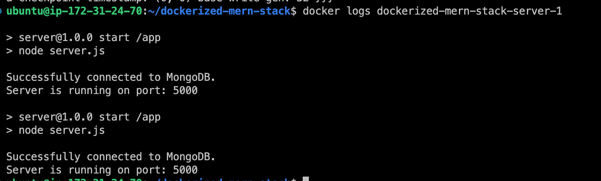

## MERN Dockerized Application


A full-stack MERN (MongoDB, Express, React, Node.js) application that is containerized using Docker and Docker Compose.

## Table of Contents
- [Technologies Used](#technologies-used)
- [Project Structure](#project-structure)
- [How to Run the Project](#how-to-run-the-project)
- [Environment Variables](#environment-variables)
- [Screenshots](#screenshots)

## Technologies Used

- **MongoDB**: Database to store records.
- **Express**: Backend framework to handle requests.
- **React**: Frontend framework for building the UI.
- **Node.js**: Runtime environment for server-side execution.
- **Docker**: Container platform to run the application.
- **Docker Compose**: To orchestrate the multi-container application.
- **Nginx**: Web server to serve the React frontend.

## Project Structure

```bash
.
├── client                  # Frontend React application
├── server                  # Backend Node.js and Express application
├── mongo-init.js           # MongoDB initialization script
└── docker-compose.yml      # Docker Compose configuration
```

## How to Run the Project

### 1. Clone the repository:

```bash
git clone https://github.com/phsinghka/dockerized-mern-stack.git
cd dockerized-mern-stack
```

### 2. Run Docker Compose:

```bash
docker-compose up --build
```

- This will start three containers: `client` (React), `server` (Node.js), and `mongo` (MongoDB).

### 3. Access the application:

- **Frontend**: `http://localhost:80`
- **Backend API**: `http://localhost:5000`

## Environment Variables

- `ATLAS_URI`: MongoDB connection string used by the backend.
- `PORT`: Port for the backend server.
- `REACT_APP_YOUR_HOSTNAME`: Backend API URL for the frontend.

## Screenshots

### Home Page


### Running Containers


### Docker Server Logs



